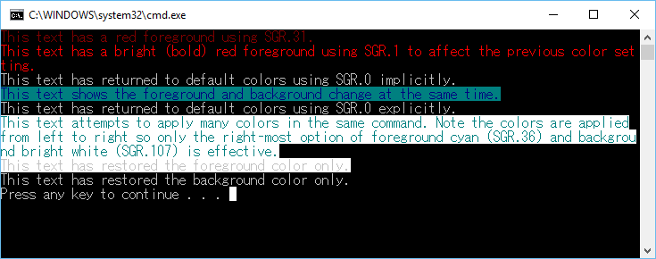

# Console Virtual Terminal Sequences


Virtual terminal sequences are control character sequences that can control cursor movement, color/font mode, and other operations.

The following terminal sequences are intercepted by the console host when written into the output stream if the **ENABLE\_VIRTUAL\_TERMINAL\_PROCESSING** flag is set on the screen buffer handle using the [**SetConsoleMode**](setconsolemode.md) flag. You can use [**GetConsoleMode**](getconsolemode.md) and **SetConsoleMode** flags to configure this behavior.

The behavior of the following sequences is based on the VT100 and derived terminal emulator technologies. More information about terminal sequences can be found at <http://vt100.net>.

## Simple Cursor Positioning


In all of the following descriptions, ESC is always the hexadecimal value 0x1B. No spaces are to be included in terminal sequences. For an example of how these sequences are used in practice, please see the [example](#example) at the end of this topic.

The following table describes simple escape sequences with a single action command directly after the ESC character. These sequences have no parameters and take effect immediately.

All commands in this table are generally equivalent to calling the [**SetConsoleCursorPosition**](setconsolecursorposition.md) console API to place the cursor.

Cursor movement will be bounded by the current viewport into the buffer. Scrolling (if available) will not occur.

| Sequence | Shorthand | Behavior                              |
|----------|-----------|---------------------------------------|
| ESC A    | CUU       | Cursor Up by 1                        |
| ESC B    | CUD       | Cursor Down by 1                      |
| ESC C    | CUF       | Cursor Forward (Right) by 1           |
| ESC D    | CUB       | Cursor Backward (Left) by 1           |
| ESC 7    | DECSC     | Save Cursor Position in Memory\*      |
| ESC 8    | DECSR     | Restore Cursor Position from Memory\* |

 

**Note**  \*There will be no value saved in memory until the first use of the save command. The only way to access the saved value is with the restore command.

 

## Cursor Positioning


The following tables encompass Control Sequence Introducer (CSI) type sequences. All CSI sequences start with ESC (0x1B) followed by \[ (left bracket, 0x5B) and may contain parameters of variable length to specify more information for each operation. This will be represented by the shorthand &lt;n&gt;. Each table below is grouped by functionality with notes below each table explaining how the group works.

For all parameters, the following rules apply unless otherwise noted:

-   &lt;n&gt; represents the distance to move and is an optional parameter
-   If &lt;n&gt; is omitted or equals 0, it will be treated as a 1
-   &lt;n&gt; cannot be larger than 32,767 (maximum short value)
-   &lt;n&gt; cannot be negative

All commands in this section are generally equivalent to calling the [**SetConsoleCursorPosition**](setconsolecursorposition.md) console API.

Cursor movement will be bounded by the current viewport into the buffer. Scrolling (if available) will not occur.

| Sequence                       | Code | Description                     | Behavior                                                                                                                   |
|--------------------------------|------|---------------------------------|----------------------------------------------------------------------------------------------------------------------------|
| ESC \[ &lt;n&gt; A             | CUU  | Cursor Up                       | Cursor up by &lt;n&gt;                                                                                                     |
| ESC \[ &lt;n&gt; B             | CUD  | Cursor Down                     | Cursor down by &lt;n&gt;                                                                                                   |
| ESC \[ &lt;n&gt; C             | CUF  | Cursor Forward                  | Cursor forward (Right) by &lt;n&gt;                                                                                        |
| ESC \[ &lt;n&gt; D             | CUB  | Cursor Backward                 | Cursor backward (Left) by &lt;n&gt;                                                                                        |
| ESC \[ &lt;n&gt; E             | CNL  | Cursor Next Line                | Cursor down to beginning of &lt;n&gt;th line in the viewport                                                               |
| ESC \[ &lt;n&gt; F             | CPL  | Cursor Previous Line            | Cursor up to beginning of &lt;n&gt;th line in the viewport                                                                 |
| ESC \[ &lt;n&gt; G             | CHA  | Cursor Horizontal Absolute      | Cursor moves to &lt;n&gt;th position horizontally in the current line                                                      |
| ESC \[ &lt;n&gt; d             | VPA  | Vertical Line Position Absolute | Cursor moves to the &lt;n&gt;th position vertically in the current column                                                  |
| ESC \[ &lt;y&gt; ; &lt;x&gt; H | CUP  | Cursor Position                 | \*Cursor moves to &lt;x&gt;; &lt;y&gt; coordinate within the viewport, where &lt;x&gt; is the column of the &lt;y&gt; line |

 

**Note**  \*&lt;x&gt; and &lt;y&gt; parameters have the same limitations as &lt;n&gt; above. If &lt;x&gt; and &lt;y&gt; are omitted, they will be set to 1;1.

 

## Cursor Visibility


All commands in this section are generally equivalent to calling [**SetConsoleCursorInfo**](setconsolecursorinfo.md) console API to toggle cursor visibility.

| Sequence      | Code    | Description                  | Behavior        |
|---------------|---------|------------------------------|-----------------|
| ESC \[ ? 25 h | DECTCEM | Text Cursor Enable Mode Show | Show the cursor |
| ESC \[ ? 25 l | DECTCEM | Text Cursor Enable Mode Hide | Hide the cursor |

 

## Viewport Positioning


All commands in this section are generally equivalent to calling [**SetConsoleWindowInfo**](setconsolewindowinfo.md) console API to adjust the current console window viewport.

Viewport movement is bounded by the current text buffer size.

**Caution**  The command names are misleading. Scroll refers to which direction the text moves during the operation, not which way the scroll bar moves.

 

| Sequence           | Code | Description | Behavior                                                                                             |
|--------------------|------|-------------|------------------------------------------------------------------------------------------------------|
| ESC \[ &lt;n&gt; S | SU   | Scroll Up   | Scroll text up by &lt;n&gt;. Also known as pan down, new lines fill in from the bottom of the screen |
| ESC \[ &lt;n&gt; T | SD   | Scroll Down | Scroll down by &lt;n&gt;. Also known as pan up, new lines fill in from the top of the screen         |

 

## Text Modification


All commands in this section are generally equivalent to calling [**FillConsoleOutputCharacter**](fillconsoleoutputcharacter.md), [**FillConsoleOutputAttribute**](fillconsoleoutputattribute.md), and [**ScrollConsoleScreenBuffer**](scrollconsolescreenbuffer.md) console APIs to modify the text buffer contents.

| Sequence           | Code | Description      | Behavior                                                                                                                                         |
|--------------------|------|------------------|--------------------------------------------------------------------------------------------------------------------------------------------------|
| ESC \[ &lt;n&gt; @ | ICH  | Insert Character | Insert &lt;n&gt; spaces at the current cursor position, shifting all existing text to the right. Text exiting the screen to the right is removed |
| ESC \[ &lt;n&gt; P | DCH  | Delete Character | Delete &lt;n&gt; characters at the current cursor position, shifting in space characters from the right edge of the screen                       |

 

For the following commands, the parameter &lt;n&gt; has 3 valid values:

-   0 erases from the beginning of the line/display up to and including the current cursor position
-   1 erases from the current cursor position (inclusive) to the end of the line/display
-   2 erases the entire line/display

| Sequence           | Code | Description      | Behavior                                                                                     |
|--------------------|------|------------------|----------------------------------------------------------------------------------------------|
| ESC \[ &lt;n&gt; J | ED   | Erase in Display | Replace all text in the current viewport/screen specified by &lt;n&gt; with space characters |
| ESC \[ &lt;n&gt; K | EL   | Erase in Line    | Replace all text on the line with the cursor specified by &lt;n&gt; with space characters    |

 

## Text Formatting


All commands in this section are generally equivalent to calling [**SetConsoleTextAttribute**](setconsoletextattribute.md) console APIs to adjust the formatting of all future writes to the console output text buffer.

This command is special in that the &lt;n&gt; position below can accept between 0 and 16 parameters separated by semicolons.

When no parameters are specified, it is treated the same as a single 0 parameter.

| Sequence           | Code | Description            | Behavior                                                        |
|--------------------|------|------------------------|-----------------------------------------------------------------|
| ESC \[ &lt;n&gt; m | SGR  | Set Graphics Rendition | Set the format of the screen and text as specified by &lt;n&gt; |

 

The following table of values can be used in &lt;n&gt; to represent different formatting modes.

Formatting modes are applied from left to right. Applying competing formatting options will result in the right-most option taking precedence.

For options that specify colors, the colors will be used as defined in the console color table which can be modified using the [**SetConsoleScreenBufferInfoEx**](setconsolescreenbufferinfoex.md) API. If the table is modified to make the “blue” position in the table display an RGB shade of red, then all calls to **Foreground Blue** will display that red color until otherwise changed.

| Value | Description               | Behavior                                                          |
|-------|---------------------------|-------------------------------------------------------------------|
| 0     | Default                   | Returns all attributes to the default state prior to modification |
| 1     | Bold/Bright               | Applies brightness/intensity flag to foreground color             |
| 4     | Underline                 | Adds underline                                                    |
| 24    | No underline              | Removes underline                                                 |
| 7     | Negative                  | Swaps foreground and background colors                            |
| 27    | Positive (No negative)    | Returns foreground/background to normal                           |
| 30    | Foreground Black          | Applies non-bold/bright black to foreground                       |
| 31    | Foreground Red            | Applies non-bold/bright red to foreground                         |
| 32    | Foreground Green          | Applies non-bold/bright green to foreground                       |
| 33    | Foreground Yellow         | Applies non-bold/bright yellow to foreground                      |
| 34    | Foreground Blue           | Applies non-bold/bright blue to foreground                        |
| 35    | Foreground Magenta        | Applies non-bold/bright magenta to foreground                     |
| 36    | Foreground Cyan           | Applies non-bold/bright cyan to foreground                        |
| 37    | Foreground White          | Applies non-bold/bright white to foreground                       |
| 39    | Foreground Default        | Applies only the foreground portion of the defaults (see 0)       |
| 40    | Background Black          | Applies non-bold/bright black to background                       |
| 41    | Background Red            | Applies non-bold/bright red to background                         |
| 42    | Background Green          | Applies non-bold/bright green to background                       |
| 43    | Background Yellow         | Applies non-bold/bright yellow to background                      |
| 44    | Background Blue           | Applies non-bold/bright blue to background                        |
| 45    | Background Magenta        | Applies non-bold/bright magenta to background                     |
| 46    | Background Cyan           | Applies non-bold/bright cyan to background                        |
| 47    | Background White          | Applies non-bold/bright white to background                       |
| 49    | Background Default        | Applies only the background portion of the defaults (see 0)       |
| 90    | Bright Foreground Black   | Applies bold/bright black to foreground                           |
| 91    | Bright Foreground Red     | Applies bold/bright red to foreground                             |
| 92    | Bright Foreground Green   | Applies bold/bright green to foreground                           |
| 93    | Bright Foreground Yellow  | Applies bold/bright yellow to foreground                          |
| 94    | Bright Foreground Blue    | Applies bold/bright blue to foreground                            |
| 95    | Bright Foreground Magenta | Applies bold/bright magenta to foreground                         |
| 96    | Bright Foreground Cyan    | Applies bold/bright cyan to foreground                            |
| 97    | Bright Foreground White   | Applies bold/bright white to foreground                           |
| 100   | Bright Background Black   | Applies bold/bright black to background                           |
| 101   | Bright Background Red     | Applies bold/bright red to background                             |
| 102   | Bright Background Green   | Applies bold/bright green to background                           |
| 103   | Bright Background Yellow  | Applies bold/bright yellow to background                          |
| 104   | Bright Background Blue    | Applies bold/bright blue to background                            |
| 105   | Bright Background Magenta | Applies bold/bright magenta to background                         |
| 106   | Bright Background Cyan    | Applies bold/bright cyan to background                            |
| 107   | Bright Background White   | Applies bold/bright white to background                           |

 

## <a href="" id="example"></a>Example of SGR terminal sequences


The following code provides several examples of text formatting.

```
#include <stdio.h>
#include <wchar.h>
#include <windows.h>

int main()
{
    // Set output mode to handle virtual terminal sequences
    HANDLE hOut = GetStdHandle(STD_OUTPUT_HANDLE);
    if (hOut == INVALID_HANDLE_VALUE)
    {
        return GetLastError();
    }

    DWORD dwMode = 0;
    if (!GetConsoleMode(hOut, &amp;dwMode))
    {
        return GetLastError();
    }

    dwMode |= ENABLE_VIRTUAL_TERMINAL_PROCESSING;
    if (!SetConsoleMode(hOut, dwMode))
    {
        return GetLastError();
    }
    
    // Try some Set Graphics Rendition (SGR) terminal escape sequences
    wprintf(L"\x1b[31mThis text has a red foreground using SGR.31.\r\n");
    wprintf(L"\x1b[1mThis text has a bright (bold) red foreground using SGR.1 to affect the previous color setting.\r\n");
    wprintf(L"\x1b[mThis text has returned to default colors using SGR.0 implicitly.\r\n");
    wprintf(L"\x1b[34;46mThis text shows the foreground and background change at the same time.\r\n");
    wprintf(L"\x1b[0mThis text has returned to default colors using SGR.0 explicitly.\r\n");
    wprintf(L"\x1b[31;32;33;34;35;36;101;102;103;104;105;106;107mThis text attempts to apply many colors in the same command. Note the colors are applied from left to right so only the right-most option of foreground cyan (SGR.36) and background bright white (SGR.107) is effective.\r\n");
    wprintf(L"\x1b[39mThis text has restored the foreground color only.\r\n");
    wprintf(L"\x1b[49mThis text has restored the background color only.\r\n");

    return 0;
}
```

**Note**  In the previous example, the string '`\x1b[31m`' is the implementation of **ESC \[ &lt;n&gt; m** with &lt;n&gt; being 31.

 

The following graphic shows the output of the previous code example.



 

 


