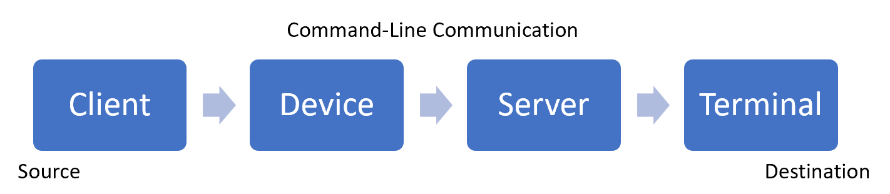

# Windows Console and Terminal Ecosystem Roadmap

This document is a high-level roadmap of the Windows Console and Windows Terminal products. It covers:

- How Windows Console and Windows Terminal fit into the ecosystem of command-line applications across Windows and other operating systems.

- A history and future roadmap of the products, features, and strategies that are part of building the platform, as well as building for this platform.

The focus of the current console/terminal era at Microsoft is to bring a first-class terminal experience directly to developers on the Windows platform and to [phase out](classic-vs-vt.md) classic Windows Console APIs, replacing them with [virtual terminal sequences](console-virtual-terminal-sequences.md) utilizing [pseudoconsole](pseudoconsoles.md). **[Windows Terminal](/windows/terminal/)** showcases this transition into a first-class experience, inviting [open source collaboration](https://github.com/microsoft/terminal) from the developer community, supporting a full spectrum of mixing and matching of client command-line and terminal hosting applications, and unifying the Windows ecosystem with all other platforms.

## Definitions

It is recommended to familiarize yourself with the [definitions](definitions.md) of common terminology used in this space before proceeding. Common terminology includes: [Command Line (or Console) applications](definitions.md#command-line-applications), [standard handles (`STDIN`, `STDOUT`, `STDERR`)](definitions.md#standard-handles), [TTY and PTY devices](definitions.md#ttypty), [clients and servers](definitions.md#clients-and-servers), [console subsystem](definitions.md#console-subsystem), [console host](definitions.md#console-host), [pseudoconsole](definitions.md#pseudoconsole), and [terminal](definitions.md#terminal).

## Architecture

The general architecture of the system is in four parts: client, device, server, and terminal.

### Client

The client is a command-line application that uses a text-based interface to enable the user to enter commands (rather than a mouse-based user interface), returning a text representation of the result. On Windows, the Console API provides a communications layer between the client and the device. (This can also be a standard console handle with device control APIs).

### Device

The device is an intermediate message-handling communications layer between two processes, the client and the server. On Windows, this is the console driver. On other platforms, it is the TTY or PTY device. Other devices like files, pipes, and sockets may be used as this communication channel if the entire transaction is in plain text or contains [virtual terminal sequences](console-virtual-terminal-sequences.md), but not with [Windows Console APIs](console-functions.md).

### Server

The server interprets the requested API calls or messages from the client. On Windows in the classic operating mode, the server also creates a user interface to present the output to the screen. The server additionally collects input to send back in response messages to the client, via the driver, like a terminal bundled in the same module. Using [pseudoconsole](pseudoconsoles.md) mode, it instead is only a translator to present this information in [virtual terminal sequences](console-virtual-terminal-sequences.md) to an attached terminal.

### Terminal

The terminal is the final layer providing graphical display and interactivity services to the user. It is responsible for capturing input and encoding it as [virtual terminal sequences](console-virtual-terminal-sequences.md), which eventually reach the client's `STDIN`. It will also receive and decode the *virtual terminal sequences* that it receives back from the client's `STDOUT` for presentation on the screen.

#### Further connections

As an addendum, further connections can be performed by chaining applications that serve multiple roles into one of the endpoints. For instance, an SSH session has two roles: it is a **terminal** for the command-line application running on one device, but it forwards all received information on to a **client** role on another device. This chaining can occur indefinitely across devices and contexts offering broad scenario flexibility.

On non-Windows platforms, the **server** and **terminal** roles are a single unit because there is no need for a translation compatibility layer between an API set and [virtual terminal sequences](console-virtual-terminal-sequences.md).

## Microsoft products

All of the Microsoft Windows command-line products are now available on GitHub in an open source repository, [microsoft/terminal](https://github.com/microsoft/terminal).

### Windows Console Host

This is the traditional Windows user-interface for command-line applications. It handles all console API servicing called from any attached command-line application. Windows Console also handles the graphical user interface (GUI) representation on behalf of all of those applications. It is found in the system directory as `conhost.exe`, or `openconsole.exe` in its open source form. It comes with the Windows operating system. It can also be found in other Microsoft products built from the open source repository for a more up-to-date implementation of the [pseudoconsole](pseudoconsoles.md) infrastructure. Per the definitions above, it operates in either a combined server-and-terminal role traditionally or a server-only role through the preferred _pseudoconsole_ infrastructure.

### Windows Terminal

This is the new Windows interface for command-line applications. Windows Terminal serves as a first-party example of using the [pseudoconsole](pseudoconsoles.md) to separate the concerns between API servicing and text-based application interfacing, much like all non-Windows platforms.

Windows Terminal is the flagship text-mode user interface for Windows. It demonstrates the capabilities of the ecosystem and is driving Windows development toward unifying with other platforms. Windows Terminal is also an example of how to build a robust and complex modern application that spans the history and gamut of Windows APIs and frameworks. Per the definitions above, this product operates in a terminal role.

## Major historical milestones

The major historical milestones for the console subsystem are broken into implementation prior to 2014 and then moves into an overview of work performed since 2014, when the renewed focus on the command-line was formed in the Windows 10 era.

### Initial Implementation

**\[1989-1990s]** The initial console host system was implemented as an emulation of the DOS environment within the Windows operating system. Its code is entangled and cooperative with the [Command Prompt](/windows-server/administration/windows-commands/cmd), `cmd.exe`, that is a representation of that DOS environment. The console host system code shares responsibilities and privileges with the Command Prompt interpreter/shell. It also provides a base level of services for other command-line utilities to perform services in a CMD-like manner.

### DBCS for CJK

**\[1997-1999\]** Around this time, [DBCS](/windows/win32/intl/double-byte-character-sets) support ("Double-byte character set") is introduced to support CJK (Chinese, Japanese, and Korean) markets. This effort results in a bifurcation of many of the writing and reading methods inside the console to provide both "western" versions to deal with single-byte characters as well as an alternative representation for "eastern" versions where two bytes are required to represent the vast array of characters. This bifurcation included the expanding representation of a cell in the console environment to be either 1 or 2 cells wide, where 1 cell is narrow (taller than it is wide) and 2 cells is wide, full-width, or otherwise a square in which typical Chinese, Japanese, and Korean ideographs can be inscribed.

### Security/Isolation

**\[2005-2009\]** With the console subsystem experience running inside the critical system process, `csrss.exe`, connecting assorted client applications, at varying access levels, to a single super-critical and privileged process was noticed as particularly dangerous. In this era, the console subsystem was split into client, driver, and server applications. Each application could run in their own context, reducing the responsibilities and privilege in each. This isolation increased the general robustness of the system, as any failure in the console subsystem no longer affected other critical process functionality.

### User Experience Improvements

**\[2014-2016\]** After a long time of generally scattered maintenance of the console subsystem by assorted teams across the organization, a new developer-focused team was formed to own and drive improvements in the console. Improvements during this time included: line selection, smooth window resizing, reflowing text, copy and paste, high DPI support, and a focus on Unicode, including the convergence of the split between "western" and "eastern" storage and stream manipulation algorithms.

### Virtual Terminal client

**\[2015-2017\]** With the arrival of the [Windows Subsystem for Linux](/windows/wsl/), Microsoft efforts to improve the experience of [Docker on Windows](/dotnet/architecture/microservices/container-docker-introduction/docker-defined), and the adoption of [OpenSSH](/windows-server/administration/openssh/openssh_overview) as the premier command-line remote execution technology, the initial implementations of [virtual terminal sequences](console-virtual-terminal-sequences.md) were introduced into the console host. This allowed the existing console to act as the terminal, attached directly to those Linux-native applications in their respective environments, rendering graphical and text attributes to the display and returning user input in the appropriate dialect.

### Virtual Terminal server

**\[2018\]** Over the past twenty years, third-party alternatives for the inbox console host were created to offer additional developer productivity, prominently centered in rich customizations and tabbed interfaces. These applications still needed to run and hide the console host window. They attach as a secondary "client" application to scrape out buffer information in polling loops as the primary command-line client application operated. Their goal was to be a terminal, like on other platforms, but in the Windows world where terminals were not replaceable.

In this time period, the [pseudoconsole](pseudoconsoles.md) infrastructure was introduced. Pseudoconsole permits any application to launch the console host in a non-interactive mode and become the final terminal interface for the user. The main limitation in this effort was the continued compatibility promise of Windows in servicing all published [Windows Console APIs](console-functions.md) for the indefinite future, while providing a replacement server-hosting interface that matched what is expected on all other platforms: [virtual terminal sequences](console-virtual-terminal-sequences.md). As such, this effort performed the mirror image of the client phase: the _pseudoconsole_ projects what would be displayed onto the screen as _virtual terminal sequences_ for a delegated host and interprets replies into Windows-format input sequences for client application consumption.

## Roadmap for the future

### Terminal applications

**\[2019-Now\]** This is the open source era for the console subsystem, focusing on the new Windows Terminal. Announced during the Microsoft Build conference in May 2019, Windows Terminal is entirely on GitHub at [microsoft/terminal](https://github.com/microsoft/terminal). Building the Windows Terminal application on top of the refined platform for [pseudoconsole](pseudoconsoles.md) will be the focus of this era, bringing a first-class terminal experience directly to developers on the Windows platform.

**[Windows Terminal](/windows/terminal/)** intends not only to showcase the platform — including the [WinUI](/windows/apps/winui/) interface technology, the [MSIX](/windows/msix/) packaging model, and the [C++/WinRT](/windows/uwp/winrt-components/create-a-windows-runtime-component-in-cppwinrt) component architecture — but also as a validation of the platform itself. Windows Terminal is driving the Windows organization to open and evolve the app platform as necessary to continue to lift the productivity of developers. The Windows Terminal unique set of power user and developer requirements drive the modern Windows platform requirements for what those markets truly need from Windows.

Inside the Windows operating system, this includes [retiring the classic console host user interface](./classic-vs-vt.md) from its default position in favor of [Windows Terminal](/windows/terminal/), [ConPTY](https://devblogs.microsoft.com/commandline/windows-command-line-introducing-the-windows-pseudo-console-conpty/), and [virtual terminal sequences](console-virtual-terminal-sequences.md).

Lastly, this era intends to offer full choice over the default experience, whether it is the Windows Terminal product or any alternative terminals.

### Client support library

**\[Future\]** With the support and documentation of [virtual terminal sequences](console-virtual-terminal-sequences.md) on the client side, we strongly encourage Windows command-line utility developers to use virtual terminal sequences first over the classic Windows APIs to gain the benefit of a unified ecosystem with all platforms. However, one significant missing piece is that other platforms have a wide array of client-side helper libraries for handling input like [readline](https://tiswww.case.edu/php/chet/readline/rltop.html) and graphical display like [ncurses](https://invisible-island.net/ncurses/ncurses.html). This particular future road map element represents the exploration of what the ecosystem offers and how we can accelerate the adoption of virtual terminal sequences in Windows command-line applications over the classic Console API.

### Sequence Passthrough

**\[Future\]** The combination of virtual terminal client and server implementations allows the full mixing and matching of client command-line and terminal hosting applications. This combination can speak to either the classic [Windows Console APIs](console-functions.md) or [virtual terminal sequences](console-virtual-terminal-sequences.md), however, there is an overhead cost to translating this into the classic compatible Windows method and then back into the more universal virtual terminal method.

Once the market sufficiently adopts _virtual terminal sequences_ and UTF-8 on Windows, the conversion/interpretation job of the console host can be optionally disabled. The console host would then become a simple API call servicer and relay from device calls to the hosting application via the [pseudoconsole](pseudoconsoles.md). This change will increase performance and maximize the dialect of sequences that can be spoken between the client application and the terminal. Through this change additional interactivity scenarios would be enabled and *(finally)* bring the Windows world into alignment with the family of all other platforms in the command-line application space.
