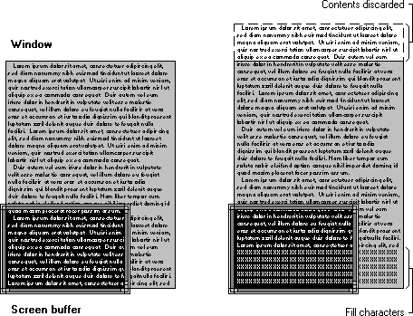

# Scrolling the Screen Buffer

The console window displays a portion of the active screen buffer. Each screen buffer maintains its own current window rectangle that specifies the coordinates of the upper left and lower right character cells to be displayed in the console window. To determine the current window rectangle of a screen buffer, use [**GetConsoleScreenBufferInfo**](getconsolescreenbufferinfo.md). When a screen buffer is created, the upper left corner of its window is at the upper left corner of the console screen buffer at (0,0).

The window rectangle can change to display different parts of the console screen buffer. The window rectangle of a screen buffer can change in the following situations:

-   When [**SetConsoleWindowInfo**](setconsolewindowinfo.md) is called to specify a new window rectangle, it scrolls the view of the console screen buffer by changing the position of the window rectangle without changing the size of the window. For examples of scrolling the window's contents, see [Scrolling a Screen Buffer's Window](scrolling-a-screen-buffer-s-window.md).

    

-   When using the [**WriteFile**](https://msdn.microsoft.com/library/windows/desktop/aa365747) function to write to a screen buffer with wrap at end-of-line (EOL) output mode enabled, the window rectangle shifts automatically, so the cursor is always displayed.
-   When the [**SetConsoleCursorPosition**](setconsolecursorposition.md) function specifies a new cursor position that is outside the boundaries of the current window rectangle, the window rectangle shifts automatically to display the cursor.
-   When the user changes the size of the console window or uses the window's scroll bars, the window rectangle of the active screen buffer can change. This change is not reported as a window resizing event in the input buffer.

In each of these situations, the window rectangle shifts to display a different part of the console screen buffer, but the contents of the console screen buffer remain in the same position. The following situations can cause the console screen buffer's contents to shift:

-   When the [**ScrollConsoleScreenBuffer**](scrollconsolescreenbuffer.md) function is called, a rectangular block is copied from one part of a screen buffer to another.
-   When using [**WriteFile**](https://msdn.microsoft.com/library/windows/desktop/aa365747) to write to a screen buffer with wrap at EOL output mode enabled, the console screen buffer's contents scroll automatically when the end of the console screen buffer is encountered. This scrolling discards the top row of the console screen buffer.

[**ScrollConsoleScreenBuffer**](scrollconsolescreenbuffer.md) specifies the console screen buffer rectangle that is moved and the new upper left coordinates to which the rectangle is copied. This function can scroll a portion or the entire contents of the console screen buffer.

The illustration shows a [**ScrollConsoleScreenBuffer**](scrollconsolescreenbuffer.md) operation that scrolls the entire contents of the console screen buffer up by several rows. The contents of the top rows are discarded, and the bottom rows are filled with a specified character and color.

The effects of [**ScrollConsoleScreenBuffer**](scrollconsolescreenbuffer.md) can be limited by specifying an optional clipping rectangle so that the contents of the console screen buffer outside the clipping rectangle are unchanged. The effect of clipping is to create a subwindow (the clipping rectangle) whose contents are scrolled without affecting the rest of the console screen buffer. For an example that uses **ScrollConsoleScreenBuffer**, see [Scrolling a Screen Buffer's Contents](scrolling-a-screen-buffer-s-contents.md).

 

 

